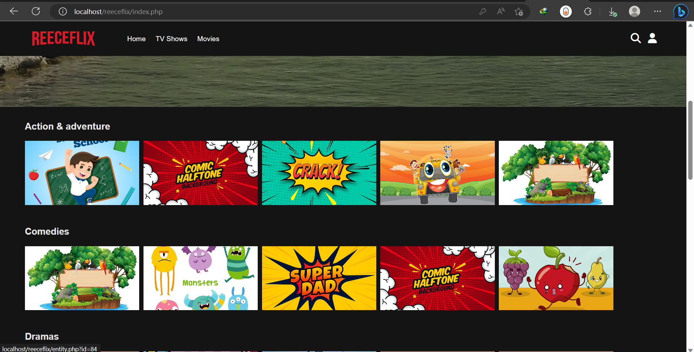
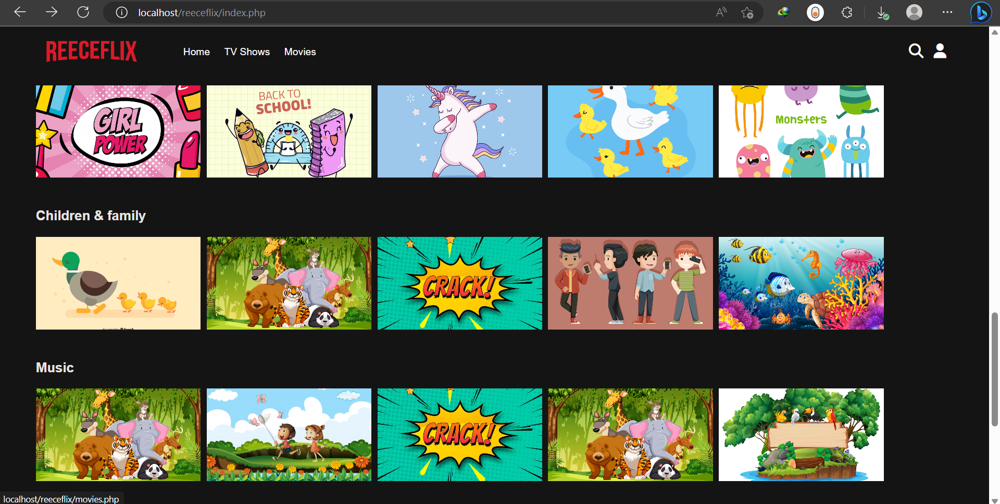
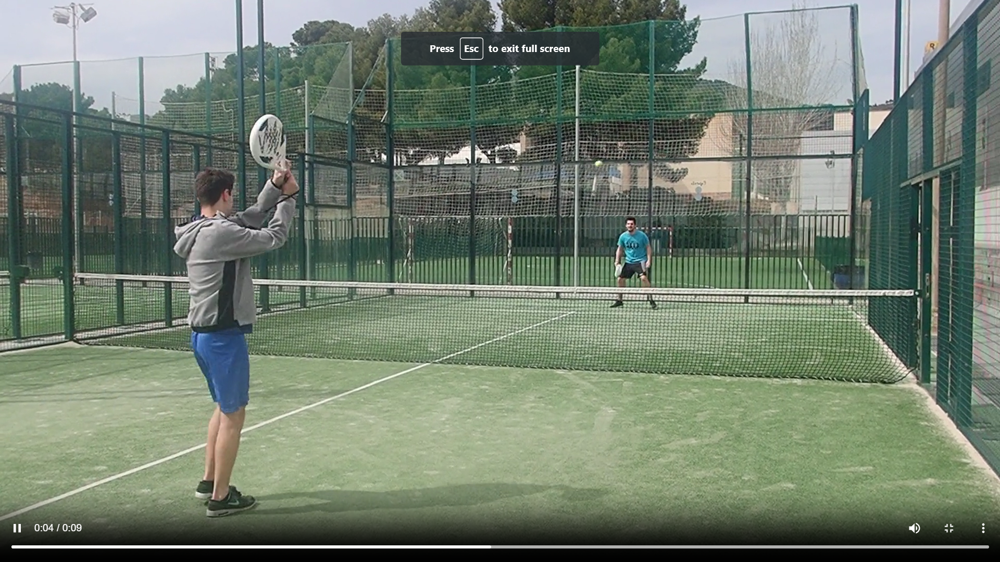

# Netflix Clone 

This repository contains the source code for my Netflix clone project, an in-progress project replicating the functionality and design of Netflix.

## Overview

This project mimics the main features of Netflix, such as browsing movies and shows, displaying categories, and searching for specific content. Note that the project is not complete due to inconveniences in integrating the PayPal SDK.

## Screenshots

Here are a few screenshots of the application's user interface:


*Description of Screenshot 1*


*Description of Screenshot 2*

## Video Demonstration

Click the image below to watch an image of the video streaming of the Netflix clone:



## Project Structure

Here's a brief overview of the project structure:

- `ajax` - This directory contains PHP files that handle various AJAX requests such as `addDuration.php`, `getProgress.php`, `getSearchResults.php`, `setFinished.php`, `UpdateDuration.php`.
- `assets` - This directory holds static files including images, styles, and JavaScript files.
- `includes` - This directory contains the PHP classes required by the application, such as `Account.php`, `CategoryContainer.php`, `Constants.php`, `Entity.php`, `EntityProvider.php`, `ErrorMessage.php`, `FormSanitizer.php`, `PreviewProvider.php`, `SearchResultsProvider.php`, `Season.php`, `SeasonProvider.php`, `User.php`, `Video.php`, `VideoProvider.php`.
- `config.php` - Contains the configuration settings for the application.
- `header.php`, `navBar.php` - Contains the header and navigation bar of the application.
- The root also contains various PHP files that represent different pages of the application such as `category.php`, `entity.php`, `index.php`, `login.php`, `movies.php`, `profile.php`, `register.php`, `search.php`, `shows.php`, `watch.php`.


## Setup and Run

To set up and run this application, you would need to follow these steps:

1. Clone the repository to your local machine.
   ```bash
   git clone https://github.com/yourusername/netflix-clone.git
   ```

2. Install XAMPP or any local server that runs PHP scripts. 

3. Start the Apache and MySQL modules using the XAMPP controller.

4. Open the XAMPP control panel and start Apache and MySQL. 

5. Open the `phpMyAdmin` and create a database called "netflix_clone". Import the database from the database file located in the repository.

6. Move the cloned repository into the `htdocs` folder of your XAMPP directory.

7. In your browser, navigate to `localhost/netflix-clone` (if the cloned repository is directly inside the `htdocs` folder).

That's it! You should now be able to see the Netflix clone project running locally on your machine.

## Contribution

Feel free to contribute to this project by submitting a pull request. 

## Disclaimer

This project is built for educational purposes and is not meant for production.

## License

MIT

---

You just need to replace "yourusername" with your actual GitHub username in the `git clone` command. The screenshot and video links also need to be replaced with the actual paths to your screenshot and video files.
